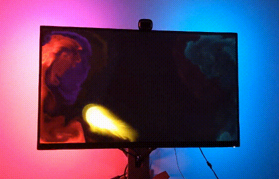
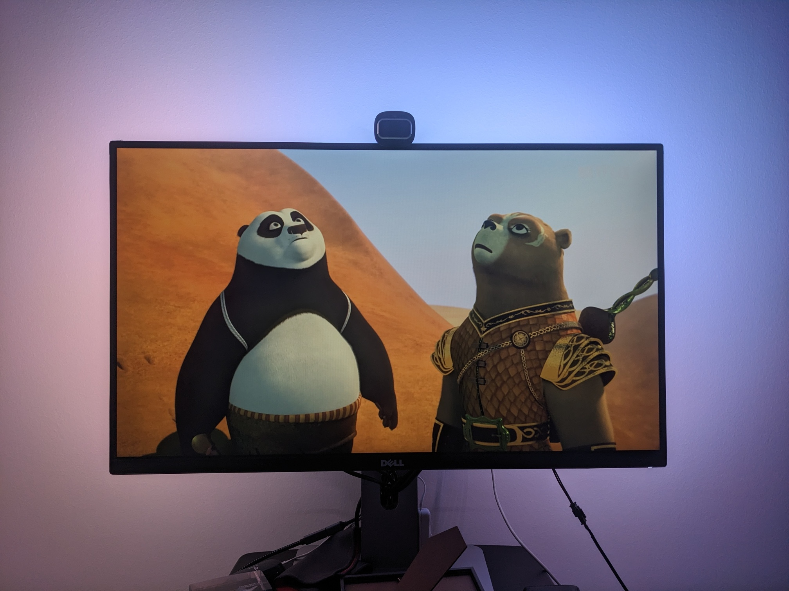
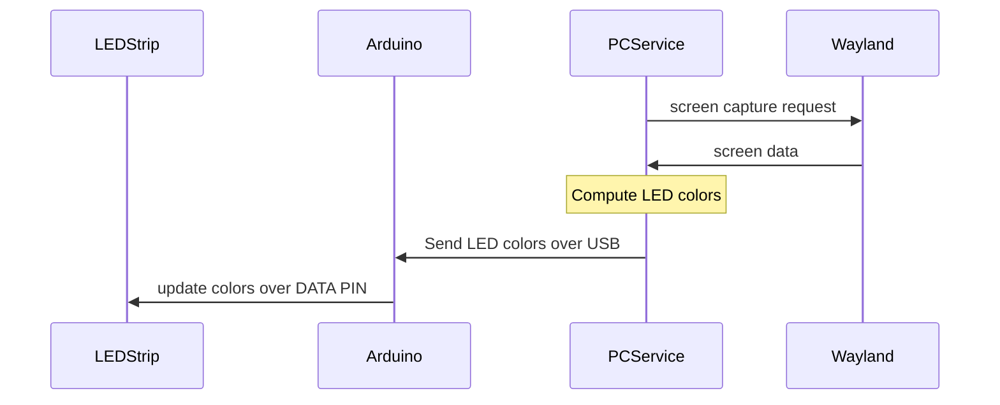
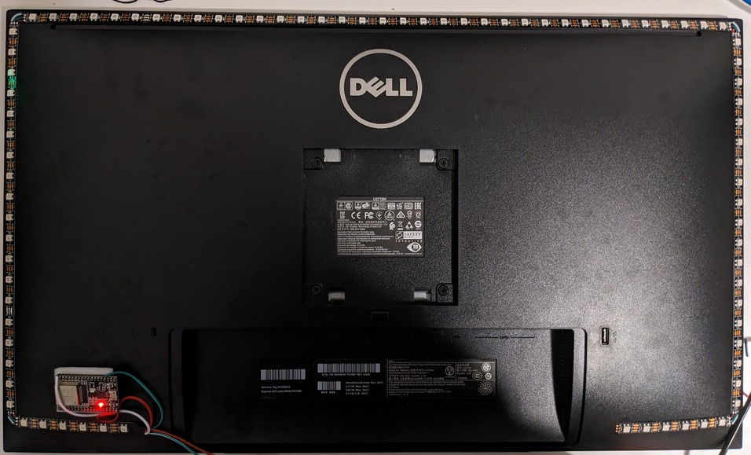

# wl-ambilight

  
   

An ambient light for Wayland.

> For Windows 11 use [tdakhran/win-ambilight](https://github.com/tdakhran/win-ambilight).
>
> For Linux(X11) use [josh26turner/Ambilight](https://github.com/josh26turner/Ambilight).

## Hardware

* arduino IDE compatible device
* [FastLED](https://fastled.io/) compatible LED strip and power supply for it
* USB cable

## Software

There are 2 parts:

* `arduino driver` - receives LED color information via USB from PC service and controls LEDs
* `PC service` - computes LED color information and sends it to `arduino driver`

## How does it work?

## Usage

### Wiring

Glue LED strip (I used WS2812B 60LED/m) to the back side of the monitor.
Cut and solder the parts together. I used ESP32 as an Arduino device and attached it as well to the monitor. The monitor has a built-in USB hub and ESP32 is connected to it. The power supply I use for LEDs has specs 5V 40W.

   

### Build

Use Arduino IDE to build a driver from `arduino` folder.
Use `cmake` to build PC service.

### Launch

Launch `./wl-ambilight -o DP-3 -d /dev/ttyUSB2`.
Works on sway + arch setup.

### Issues

#### Known

None.

#### Unknown

A lot. PRs are welcome.
